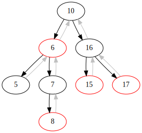
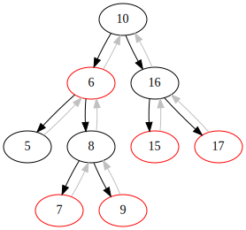
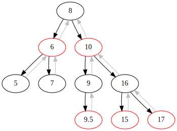

## WIP Red-Black Tree implementation

Run `render.sh` to get a visualization of the tree between the changes in `index.html`. NOTE: `graphviz` and `node` binaries should be available in path.

#### Sample insertion:

```js
const tree = mk_rbtree()
insert_many(tree, 5, 6, 7, 10, 15, 16, 17)

// visualization of those three inserts
insert(tree, 8)
insert(tree, 9)
insert(tree, 9.5)
```

- 8

- 9

- 9.5

